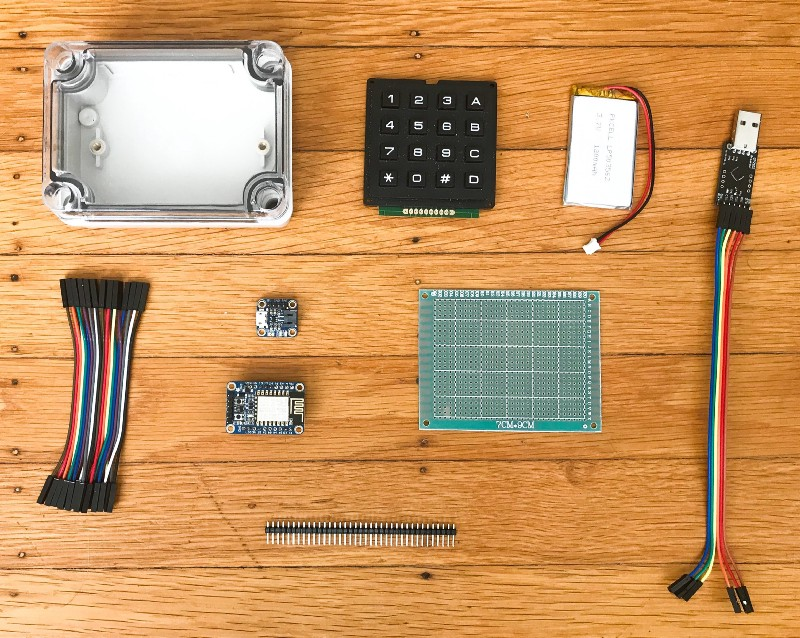

# Roku WiFi Remote

My Roku remote has a short infrared range so I built a WiFi version using the [Roku External Control API](https://sdkdocs.roku.com/display/sdkdoc/External+Control+API) and a ESP8266.

[More info on the blog post](https://medium.com/@nchourrout/building-a-better-and-bulkier-roku-remote-fa34bcb185c3)

## Supplies

  
* [Plastic enclosure](https://www.adafruit.com/product/903)
* [4x4 Matrix Keypad](https://www.adafruit.com/product/3844)
* [Lithium Ion Polymer Battery - 3.7v 1200mAh](https://www.adafruit.com/product/2471)
* [Adafruit Huzzah ESP8266 breakout](https://www.adafruit.com/product/2471)
* [Female/Female jumper wires](https://www.adafruit.com/product/1951)
* [Prototype board](https://www.dx.com/p/double-sided-glass-fiber-prototyping-pcb-universal-board-7-x-9-131731)
* [Male Headers](https://www.adafruit.com/product/2671)
* [CP2102 USB to Serial converter](https://www.amazon.com/gp/product/B009T2ZR6W/)
* [Adafruit Micro-Lipo Charger](https://www.adafruit.com/product/1904)

Not pictured:
* Label maker with black label tape for creating the stickers
* M2.5 nylon screws and nuts
* Cordless drill
* Hobby knife and a file

## Assembly

